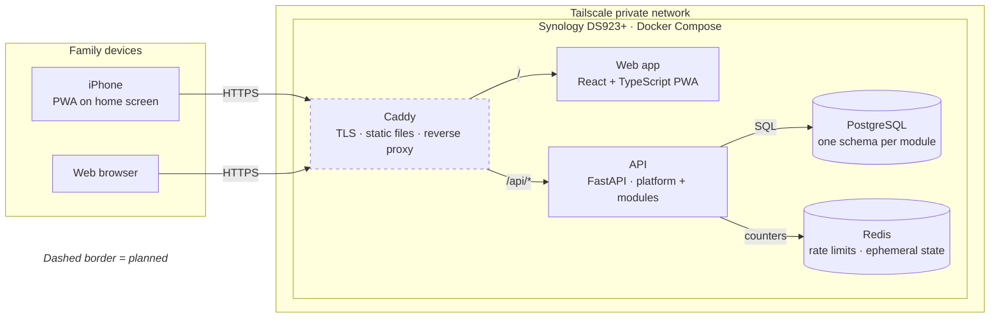

# Family Hub

[繁體中文](README.zh-TW.md)

A self-hosted, modular platform for a household's everyday systems — shared
finances first, then a family calendar and shopping lists. It runs on a home
NAS, is used daily by a real family, and is built in the open as a portfolio
project.

> **Status:** Phase 1 (platform skeleton) in progress. See the
> [roadmap](docs/vision.md#roadmap).

## Why

My spouse and I each pay for shared household expenses out of our own
pockets. At the end of the month we never know the total or how the burden
was split between us. Off-the-shelf apps either do too little (a single
shared ledger) or too much (full accounting). Family Hub starts with that
one concrete pain and grows module by module.

## Principles

- **Start small, stay extensible.** A shared platform (auth, households,
  RBAC, audit) with feature modules plugged into it.
- **Secure from day one.** Private by default, defense in depth, rate
  limiting, audit logging.
- **Near-zero running cost.** Runs on hardware we already own.
- **Docs that match the code.** Docs-as-code, generated where possible,
  checked in CI.

## Architecture at a glance

<!-- diagram: containers -->

<!-- /diagram -->

More views (system context, API internals) are in
[docs/architecture.md](docs/architecture.md). Dashed borders mark planned parts.

## Planned stack

| Layer | Choice |
|---|---|
| Backend | Python, FastAPI, SQLAlchemy 2.0, Alembic, Pydantic v2 (uv) |
| Frontend | React, TypeScript, Vite, installable PWA (pnpm) |
| API contract | OpenAPI → generated TypeScript client |
| Data | PostgreSQL, Redis |
| Authorization | Casbin (RBAC with domains) |
| Edge | Caddy |
| Hosting | Docker Compose on a Synology NAS, reachable only via Tailscale |

## Documentation

Start at [docs/index.md](docs/index.md).

- [Vision & scope](docs/vision.md)
- [Architecture](docs/architecture.md)
- [Development setup](docs/development.md)
- [Finance module](docs/modules/finance.md)
- [Threat model](docs/security/threat-model.md)
- [Architecture Decision Records](docs/adr/README.md)

## License

[MIT](LICENSE)
