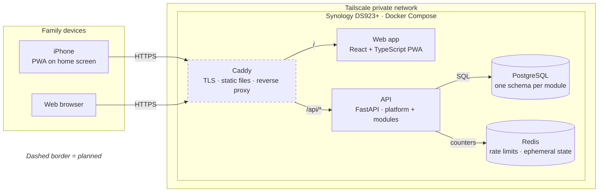

<!-- translation-of: README.md | synced: 2026-10-08 -->

# Family Hub

[English](README.md)

一個自架、模組化的家庭日常系統平台。先從共同記帳開始，之後加入家庭行事曆與採買清單。
系統跑在家中的 NAS 上，每天由真實的家庭使用，並以作品集的形式公開開發。

> **狀態：** 第 1 階段（平台骨架）已完成，接下來是第 2 階段（記帳 MVP），見[路線圖](docs/vision.zh-TW.md#路線圖)。

## 為什麼要做

我和太太各自用自己的錢支付家庭的共同開支，月底總是不清楚總額是多少、兩人各負擔了多少比例。
市面上的 App 不是功能太少（只有一本共用帳本），就是太多（完整的會計系統）。
Family Hub 從這個具體的痛點出發，再一個模組一個模組地長大。

## 原則

- **由小做大、保持擴充性。** 共用平台（登入、家庭、RBAC、稽核）加上可插拔的功能模組。
- **Day 1 就重視資安。** 預設不公開、縱深防禦、rate limiting、稽核紀錄。
- **運行成本趨近於零。** 只用家裡已有的硬體。
- **文件與程式碼一致。** docs-as-code，能自動產生的自動產生，並由 CI 檢查。

## 架構一覽

<!-- diagram: containers -->

<!-- /diagram -->

更多視角（系統情境、API 內部）請見 [docs/architecture.zh-TW.md](docs/architecture.zh-TW.md)。虛線框代表規劃中的部分。

## 預計技術堆疊

| 層 | 選擇 |
|---|---|
| 後端 | Python、FastAPI、SQLAlchemy 2.0、Alembic、Pydantic v2（uv） |
| 前端 | React、TypeScript、Vite，可安裝的 PWA（pnpm） |
| API 合約 | OpenAPI → 自動產生 TypeScript client |
| 資料 | PostgreSQL、Redis |
| 授權 | Casbin（RBAC with domains） |
| 邊緣層 | Caddy |
| 部署 | Synology NAS 上的 Docker Compose，僅能透過 Tailscale 存取 |

## 文件

從 [docs/index.zh-TW.md](docs/index.zh-TW.md) 開始。

- [願景與範圍](docs/vision.zh-TW.md)
- [架構](docs/architecture.zh-TW.md)
- [開發指南](docs/development.zh-TW.md)
- [記帳模組](docs/modules/finance.zh-TW.md)
- [威脅模型](docs/security/threat-model.zh-TW.md)
- [架構決策紀錄（ADR）](docs/adr/README.zh-TW.md)

## 授權

[MIT](LICENSE)
