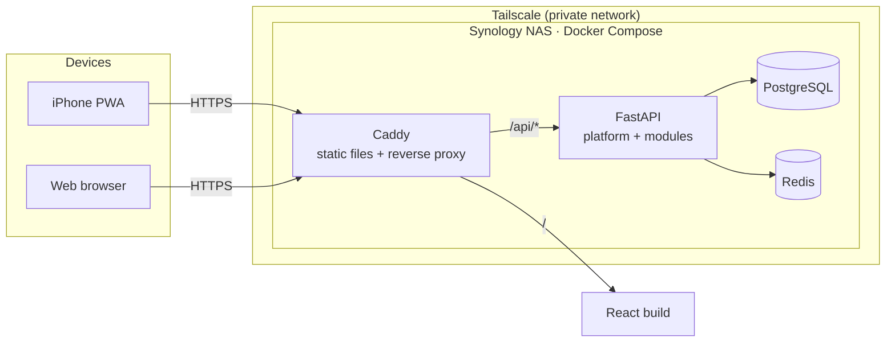

# Architecture

[繁體中文](architecture.zh-TW.md)

## Overview

Family Hub is a **modular monolith** with a **separate frontend**
([ADR-0002](adr/0002-modular-monolith-with-separate-frontend.md)). One
FastAPI process hosts a shared *platform* and any number of feature
*modules*. A React PWA talks to it via a typed client generated from the
OpenAPI spec.



The frontend and API share one origin (`/` and `/api`). This lets us use
`SameSite` session cookies without CORS ([ADR-0007](adr/0007-cookie-session-auth.md)).

## Repository layout

```
family-hub/
├── apps/
│   ├── api/                    # FastAPI service (uv)
│   │   ├── src/family_hub/
│   │   │   ├── platform/       # auth, users, households, rbac, audit
│   │   │   ├── modules/
│   │   │   │   └── finance/    # one package per module
│   │   │   ├── cli.py          # admin commands (no self-registration)
│   │   │   └── main.py         # app factory, module registration
│   │   ├── migrations/         # Alembic
│   │   └── tests/
│   └── web/                    # React + TS + Vite PWA (pnpm)
├── packages/
│   └── api-client/             # generated from OpenAPI, never hand-edited
├── deploy/                     # compose files, Caddyfile, backup scripts
└── docs/
```

## Platform

The platform owns everything that every module needs:

| Concern | Responsibility |
|---|---|
| Identity | Users, password hashing (Argon2id), sessions, CSRF. See [identity.md](platform/identity.md) |
| Tenancy | Households and memberships. Every domain row carries `household_id` |
| Authorization | Casbin RBAC with the household as the domain ([ADR-0006](adr/0006-casbin-rbac-with-domains.md)) |
| Audit | Append-only log of who changed what, when |
| Rate limiting | Redis-backed limits, stricter for auth endpoints |
| Module registry | Discovers modules, mounts routers, registers permissions |

### Roles

Roles are scoped to a household. Initial roles:

| Role | Intended for |
|---|---|
| `owner` | Manages the household, members, and roles |
| `adult` | Full use of the modules |
| `child` | Restricted. Exact permissions defined when needed |

## Module contract

A module is a Python package under `modules/` that exposes one
`Module` descriptor. The platform consumes nothing else.

| Part | Description |
|---|---|
| `name` | Unique slug, e.g. `finance`. Used for the URL prefix `/api/v1/<name>` and the DB schema |
| `router` | A FastAPI `APIRouter` |
| `permissions` | Permission strings the module defines, e.g. `finance.transaction.create` |
| `default_grants` | Which built-in roles get which permissions |
| models | SQLAlchemy models in the module's own PostgreSQL schema |

Rules that keep modules independent and extractable:

1. **No cross-module table access.** A module never joins or writes another
   module's tables. It calls the other module's service interface instead.
2. **One PostgreSQL schema per module** (`platform`, `finance`, …).
3. **Versioned API.** All routes live under `/api/v1/`.
4. **Authorization is declared, not hand-coded.** Endpoints depend on
   `require_permission("<module>.<resource>.<action>")`.
5. **Ownership is checked in the service layer.** RBAC answers "may this role
   do this action". Rules like "only the owner sees a personal ledger" are
   checked in the module's service code.

The frontend mirrors this. Each module is a route folder plus a navigation
entry.

## API contract

FastAPI generates `openapi.json`. A TypeScript client and types are
generated from it into `packages/api-client`. Pydantic schemas are the single
source of truth for request and response shapes. CI regenerates the client
and fails if it differs from what is committed.

## Data

- **PostgreSQL** is the system of record ([ADR-0005](adr/0005-postgresql-and-redis.md)).
- **Redis** holds rate-limit counters, the Casbin policy-change channel, and
  later caches and background jobs. It holds nothing that cannot be lost.
- Money is stored as integer minor units plus an ISO 4217 currency code.
- Uploaded files (future) live on the filesystem, not in the database.

## Environments

| Environment | Where | Data | Reachability |
|---|---|---|---|
| Local dev | MacBook | Fictional seed | localhost |
| Production | Synology DS923+ | Real family data | Tailscale only ([ADR-0009](adr/0009-private-access-via-tailscale.md)) |
| Public demo (later) | Free-tier cloud, fully separate | Fictional, ephemeral sandboxes | Public ([ADR-0010](adr/0010-isolated-public-demo.md)) |
