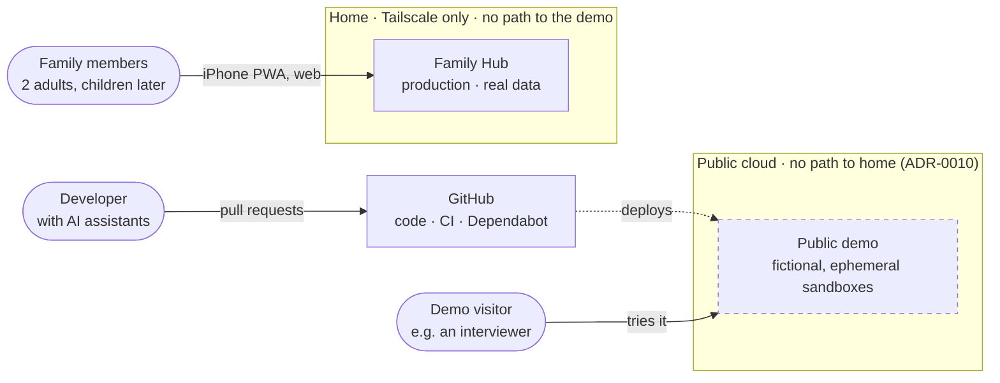
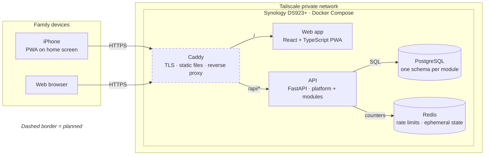
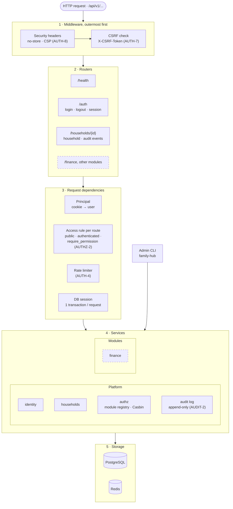

<!-- translation-of: docs/architecture.md | synced: 2026-10-08 -->

# 架構

[English](architecture.md)

## 概覽

Family Hub 是一個**模組化單體**，搭配**分離的前端**（[ADR-0002](adr/0002-modular-monolith-with-separate-frontend.zh-TW.md)）。
一個 FastAPI 程序同時承載共用的「平台」與多個功能「模組」。
React PWA 透過從 OpenAPI 規格自動產生的型別化 client 呼叫 API。

> 架構圖由 `docs/diagrams/*.mmd` 產生（標籤統一使用英文，維持單一來源）。
> 請修改來源檔，再執行 `make diagrams`。虛線框代表規劃中、尚未實作。

### 系統情境

誰在使用這個系統，以及正式環境與公開 Demo 之間的硬性邊界。

<!-- diagram: system-context -->

<!-- /diagram -->

### 容器

正式環境中運行的程序，以及請求如何在它們之間流動。

<!-- diagram: containers -->

<!-- /diagram -->

前端與 API 位於同一個網域（`/` 與 `/api`），因此可以使用 `SameSite` 的 session cookie，
也不需要處理 CORS（[ADR-0007](adr/0007-cookie-session-auth.zh-TW.md)）。

## Repo 結構

```
family-hub/
├── apps/
│   ├── api/                    # FastAPI 服務（uv）
│   │   ├── src/family_hub/
│   │   │   ├── platform/       # 登入、使用者、家庭、RBAC、稽核
│   │   │   ├── modules/
│   │   │   │   └── finance/    # 每個模組一個套件
│   │   │   ├── cli.py          # 管理指令（不開放自行註冊）
│   │   │   └── main.py         # app factory、模組註冊
│   │   ├── migrations/         # Alembic
│   │   └── tests/
│   └── web/                    # React + TS + Vite PWA（pnpm）
├── packages/
│   └── api-client/             # 由 OpenAPI 自動產生，禁止手動編輯
├── deploy/                     # compose 檔、Caddyfile、備份腳本
└── docs/
```

## 平台

平台負責所有模組都需要的功能：

| 面向 | 職責 |
|---|---|
| 身分 | 使用者、密碼雜湊（Argon2id）、session、CSRF。見 [identity.zh-TW.md](platform/identity.zh-TW.md) |
| 租戶 | 家庭與成員關係。每一筆領域資料都帶有 `household_id` |
| 授權 | 每個路由的存取規則；Casbin RBAC，角色從成員關係讀取。見 [authorization.zh-TW.md](platform/authorization.zh-TW.md) |
| 稽核 | 只能新增的紀錄：誰在何時改了什麼。見 [audit.zh-TW.md](platform/audit.zh-TW.md) |
| Rate limiting | 以 Redis 計數，登入相關端點更嚴格 |
| 模組註冊 | 依明確的 `MODULES` 清單掛載各模組的 router 並註冊其權限 |

### API 內部

每個請求都會經過相同的分層，每一層只呼叫下一層。

<!-- diagram: api-components -->

<!-- /diagram -->

### 角色

角色的範圍限定在家庭內。初始角色：

| 角色 | 適用對象 |
|---|---|
| `owner` | 管理家庭、成員與角色 |
| `adult` | 完整使用各模組 |
| `child` | 受限。實際權限等需要時再定義 |

角色可繼承：`owner` ⊇ `adult` ⊇ `child`（AUTHZ-3）。

## 模組合約

模組是 `modules/` 底下的一個 Python 套件，對外只提供一個 `Module` 描述物件，並列在 `MODULES`（`modules/__init__.py`）中，平台不使用模組的其他任何東西。
平台本身也以相同方式描述（`platform/module.py`）。

| 部分 | 說明 |
|---|---|
| `name` | 唯一代稱，如 `finance`。用於 URL 前綴 `/api/v1/<name>` 與資料庫 schema |
| `routers` | FastAPI 的 `APIRouter`；每個路由都以 `/<name>` 開頭 |
| `permissions` | 模組定義的權限，如 `finance.transaction.create` |
| `grants` | 內建角色擁有哪些權限（適用繼承） |
| models | 放在模組專屬 PostgreSQL schema 中的 SQLAlchemy models |

讓模組保持獨立、未來可拆分的規則：

1. **不跨模組存取資料表。** 模組不 join、不寫入其他模組的資料表，而是呼叫對方的 service 介面。
2. **每個模組一個 PostgreSQL schema**（`platform`、`finance`⋯⋯）。
3. **API 有版本號。** 所有路由都在 `/api/v1/` 底下。
4. **授權用宣告的，不手寫判斷。** 每個路由都宣告一個存取規則，通常是 `require_permission("<模組>.<資源>.<動作>")`，否則 API 拒絕啟動（AUTHZ-2）。
5. **擁有者檢查在 service 層。** RBAC 回答「這個角色能不能做這個動作」；
   像「個人帳只有本人看得到」這類規則，在模組的 service 程式碼中檢查。

前端採用相同的結構：每個模組是一個路由資料夾加上一個導覽項目。

## API 合約

FastAPI 產生 [`docs/reference/openapi.json`](reference/openapi.json)，再以 `@hey-api/openapi-ts` 由它產生 TypeScript client 與型別，放進 `packages/api-client`。
Pydantic schema 是請求與回應格式的唯一來源。Operation ID 的格式是 `<tag>_<函式名稱>`（例如 `auth_login`），因此 client 提供的是 `authLogin()`。
`make generate` 會同時更新兩者；若任一與已 commit 的內容不同，CI 就會失敗。

## 資料

- **PostgreSQL** 是正式的資料來源（[ADR-0005](adr/0005-postgresql-and-redis.zh-TW.md)）。
- **Redis** 存放 rate limit 計數、Casbin 策略變更的通知頻道，之後也會用於快取與背景工作。
  Redis 裡不放任何不能遺失的資料。
- 金額以整數的最小貨幣單位儲存，並附上 ISO 4217 幣別代碼。
- 上傳的檔案（未來功能）存放在檔案系統，不放進資料庫。

## 環境

| 環境 | 位置 | 資料 | 可存取範圍 |
|---|---|---|---|
| 本機開發 | MacBook | 虛構示範資料 | localhost |
| 正式環境 | Synology DS923+ | 真實家庭資料 | 僅限 Tailscale（[ADR-0009](adr/0009-private-access-via-tailscale.zh-TW.md)） |
| 公開 Demo（之後） | 雲端免費方案，完全獨立 | 虛構資料，沙盒會自動銷毀 | 公開（[ADR-0010](adr/0010-isolated-public-demo.zh-TW.md)） |
