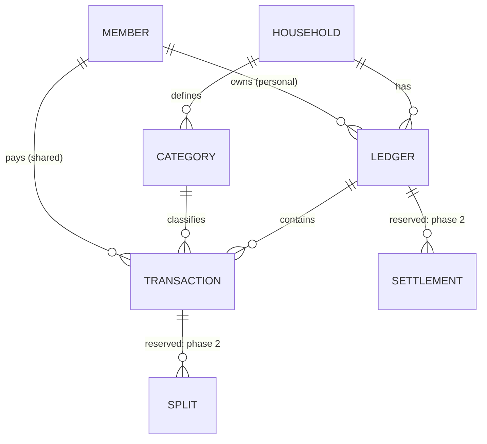

# Finance Module

[繁體中文](finance.zh-TW.md)

## Problem

Two adults each pay shared household expenses from their own money. At
month-end they cannot see the total, or how the burden was split. They have
**not yet agreed on a target ratio**. They first want a few months of real
data to base that decision on.

Each adult also wants a private ledger to track their own money flow.

## Concepts

| Concept | Meaning |
|---|---|
| **Ledger** | A book of transactions. Either `shared` (all adult members) or `personal` (exactly one owner) |
| **Transaction** | One expense or income: amount, currency, date, category, note. In a shared ledger it also records the **payer** |
| **Category** | Household-defined classification (e.g. groceries, utilities), of kind `expense` or `income` |
| **Split** | *Reserved.* How much of a shared transaction each member should bear |
| **Settlement** | *Reserved.* A recorded transfer that squares up a period |

## Business rules

| ID | Rule |
|---|---|
| FIN-1 | A shared expense is entered **once**, in the shared ledger, with a payer. |
| FIN-2 | A member's personal view = their personal-ledger transactions **plus** a derived subtotal "shared expenses I paid". The derived part is computed, never copied. Expanding it shows the shared transactions. |
| FIN-3 | **Observation mode** (MVP): a shared ledger has no split rule. The dashboard reports what happened; it does not say who owes whom. |
| FIN-4 | Amounts are stored as integers in the currency's minor unit, with an ISO 4217 code. MVP uses TWD only, but the code is always stored. |
| FIN-5 | A personal ledger is readable and writable only by its owner. This is an ownership check in the service layer, independent of role. |
| FIN-6 | Every create, update, and delete is written to the audit log with the actor and the before/after values. |
| FIN-7 | Transactions may be dated in the past (manual back-entry). There is no bulk import in the MVP. |
| FIN-8 | Months are calendar months in the household's time zone (default `Asia/Taipei`). |
| FIN-9 | Deletion is soft (`deleted_at`) so the audit trail and totals can be reconstructed. |

## Shared-ledger dashboard (observation mode)

For a selected month:

| Metric | Definition |
|---|---|
| Total shared spending | Sum of non-deleted expense transactions in the shared ledger |
| Paid by member | Sum of those transactions grouped by payer |
| Share by member | Paid by member ÷ total |
| Monthly trend | Share by member for each of the last N months |
| By category | Total and per-payer amounts per category |

The numbers below are illustrative only:

> Shared spending this month **NT$ 42,300**
> A paid 28,000 (66%) · B paid 14,300 (34%)

## MVP scope

In:
- Shared ledger with payer, categories, and the observation dashboard.
- One personal ledger per adult with expenses and the derived shared
  subtotal (FIN-2).
- Create, edit, soft-delete transactions; audit log.

Out (reserved in the model, built later):
- Split rules (equal, fixed ratio, income-proportional) and settlements.
- Income tracking in personal ledgers.
- Accounts and credit cards, budgets, recurring transactions, charts beyond
  the dashboard.

## Permissions (initial)

| Permission | owner | adult | child |
|---|:-:|:-:|:-:|
| `finance.ledger.read` | ✓ | ✓ | — |
| `finance.ledger.manage` | ✓ | — | — |
| `finance.transaction.read` | ✓ | ✓ | — |
| `finance.transaction.create` | ✓ | ✓ | — |
| `finance.transaction.update` | ✓ | ✓ | — |
| `finance.transaction.delete` | ✓ | ✓ | — |
| `finance.category.manage` | ✓ | ✓ | — |

Personal ledgers are further restricted by FIN-5.

## Open questions

- May one adult edit or delete a shared transaction the other entered, or
  only their own?
- What is the initial category list?
