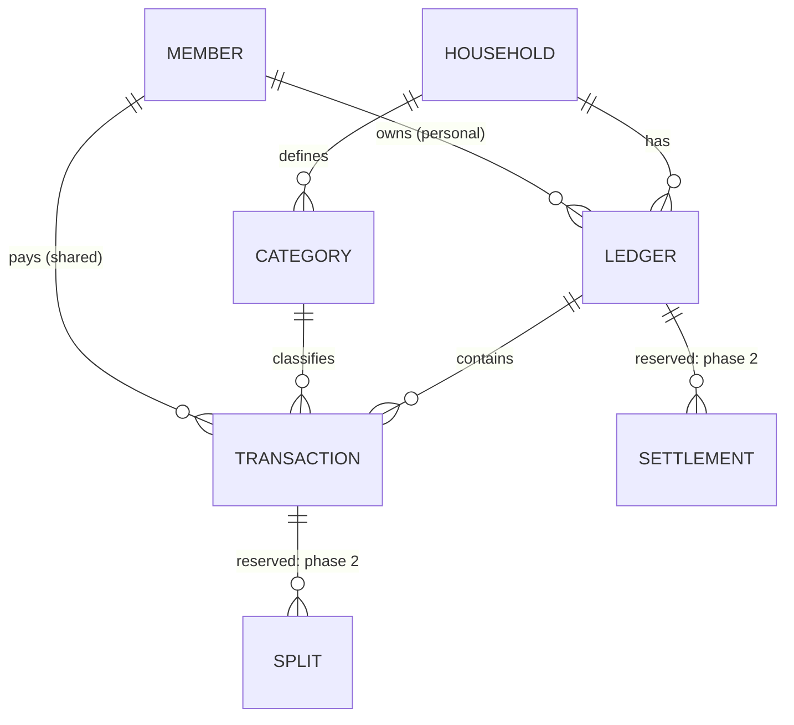

<!-- translation-of: docs/modules/finance.md | synced: 2026-10-08 -->

# 記帳模組

[English](finance.md)

## 問題

兩位成人各自用自己的錢支付家庭的共同開支，月底看不到總額，也不知道兩人各負擔了多少。
他們**還沒有約定目標比例**，想先累積幾個月的真實數據，再以此做決定。

每位成人也想要一本私人帳，追蹤自己的金錢流動。

## 概念

| 概念 | 意義 |
|---|---|
| **帳本（Ledger）** | 一組交易。分為 `shared`（所有成人成員共用）或 `personal`（只有一位擁有者） |
| **交易（Transaction）** | 一筆支出或收入：金額、幣別、日期、分類、備註。在共同帳本中還會記錄**付款人** |
| **分類（Category）** | 家庭自訂的分類（如日用品、水電），類型為 `expense` 或 `income` |
| **分攤（Split）** | *預留。* 一筆共同交易中每位成員應負擔的金額 |
| **結算（Settlement）** | *預留。* 為某段期間結清所記錄的轉帳 |

## 業務規則

| 編號 | 規則 |
|---|---|
| FIN-1 | 共同開支只輸入**一次**，記在共同帳本並標註付款人。 |
| FIN-2 | 成員的個人帳畫面 = 個人帳本的交易，**加上**自動計算的小計「我墊付的共同開支」。這部分是計算出來的，不會複製資料。展開可看到對應的共同交易。 |
| FIN-3 | **觀察模式**（MVP）：共同帳本沒有分攤規則。儀表板呈現實際發生的狀況，不計算誰欠誰。 |
| FIN-4 | 金額以該幣別最小單位的整數儲存，並附上 ISO 4217 代碼。MVP 只用新台幣，但一律儲存幣別代碼。 |
| FIN-5 | 個人帳本只有擁有者能讀寫。這是 service 層的擁有者檢查，與角色無關。 |
| FIN-6 | 每次新增、修改、刪除都寫入稽核紀錄，包含操作者與修改前後的值。 |
| FIN-7 | 交易可以填過去的日期（手動補登）。MVP 不提供批次匯入。 |
| FIN-8 | 月份以家庭時區的日曆月計算（預設 `Asia/Taipei`）。 |
| FIN-9 | 刪除採軟刪除（`deleted_at`），以便還原稽核軌跡與統計數字。 |

## 共同帳本儀表板（觀察模式）

針對選定的月份：

| 指標 | 定義 |
|---|---|
| 共同開支總額 | 共同帳本中未刪除的支出交易總和 |
| 各成員已付 | 上述交易依付款人分組加總 |
| 各成員比例 | 各成員已付 ÷ 總額 |
| 月趨勢 | 最近 N 個月各成員的比例 |
| 依分類 | 每個分類的總額與各付款人金額 |

以下數字僅為示意：

> 本月共同開支 **NT$ 42,300**
> A 已付 28,000（66%）· B 已付 14,300（34%）

## MVP 範圍

包含：
- 共同帳本：付款人、分類、觀察模式儀表板。
- 每位成人一本個人帳：支出，以及自動計算的共同開支小計（FIN-2）。
- 新增、編輯、軟刪除交易；稽核紀錄。

不包含（資料模型已預留，之後再做）：
- 分攤規則（平均、固定比例、依收入比例）與結算。
- 個人帳的收入記錄。
- 帳戶與信用卡、預算、週期性交易、儀表板以外的圖表。

## 權限（初始）

| 權限 | owner | adult | child |
|---|:-:|:-:|:-:|
| `finance.ledger.read` | ✓ | ✓ | — |
| `finance.ledger.manage` | ✓ | — | — |
| `finance.transaction.read` | ✓ | ✓ | — |
| `finance.transaction.create` | ✓ | ✓ | — |
| `finance.transaction.update` | ✓ | ✓ | — |
| `finance.transaction.delete` | ✓ | ✓ | — |
| `finance.category.manage` | ✓ | ✓ | — |

個人帳本另外受 FIN-5 限制。

## 待決問題

- 一位成人可以編輯或刪除另一位輸入的共同交易嗎？還是只能改自己輸入的？
- 初始的分類清單是什麼？
