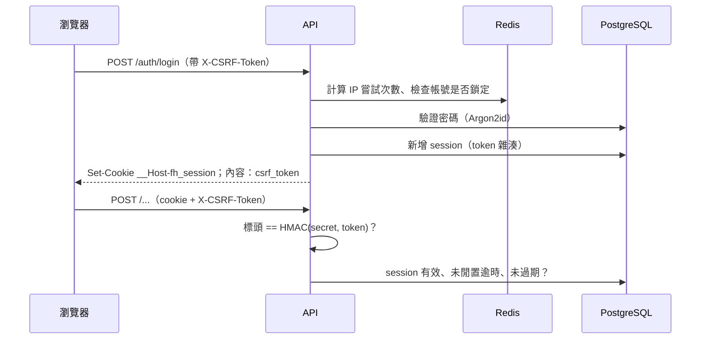

<!-- translation-of: docs/platform/identity.md | synced: 2026-10-08 -->

# 身分：帳號、登入與 Session

[English](identity.md)

說明使用者如何取得帳號、登入，以及維持登入狀態。背後的決策見 [ADR-0007](../adr/0007-cookie-session-auth.zh-TW.md)。

## 概念

| 概念 | 意義 |
|---|---|
| **使用者（User）** | 一個人，包含 email（以小寫儲存）、顯示名稱與密碼雜湊 |
| **家庭（Household）** | 租戶。所有領域資料都只屬於一個家庭 |
| **成員關係（Membership）** | 把使用者連結到家庭並指定角色：`owner`、`adult` 或 `child` |
| **Session** | 伺服器端的登入紀錄。瀏覽器以 cookie 保存一個隨機 token |

所有資料表都放在 PostgreSQL 的 `platform` schema。

## 規則

| 編號 | 規則 |
|---|---|
| AUTH-1 | **不開放自行註冊。** 家庭與成員透過管理 CLI 建立。之後可能加入 App 內的邀請流程。 |
| AUTH-2 | 密碼長度 12–128 字元，不要求字元組合（依 NIST SP 800-63B）。以 Argon2id 雜湊儲存；雜湊參數變更時，會在登入時自動升級。 |
| AUTH-3 | 登入失敗絕不透露 email 是否存在。email 不存在與密碼錯誤回傳相同的 401，花費的時間也相同（會驗證一個假雜湊）。 |
| AUTH-4 | **頻率限制。** 每個用戶端 IP 每分鐘最多嘗試登入 10 次。同一帳號 15 分鐘內失敗 5 次後，在該時段結束前即使密碼正確也無法登入。登入成功會重設該帳號的失敗次數。限制存放在 Redis，Redis 無法使用時一律拒絕。 |
| AUTH-5 | Session token 具 256 位元隨機性，只儲存其 SHA-256 雜湊。Cookie 屬性為 `HttpOnly`、`Secure`、`SameSite=Lax`、`Path=/`，不設 `Domain`，並使用 `__Host-` 前綴命名。 |
| AUTH-6 | Session 在 14 天未使用、登入後 60 天，或登出時立即結束。登出會在伺服器端撤銷 session，被複製的 token 也會失效。同一個瀏覽器再次登入時，會撤銷它先前的 session。 |
| AUTH-7 | **CSRF。** 所有會改變狀態的請求（`GET`／`HEAD`／`OPTIONS` 以外）都必須帶 `X-CSRF-Token` 標頭。若請求帶有 session cookie，標頭值必須等於 `HMAC-SHA256(FH_SECRET_KEY, session token)`。登入只要求標頭存在。 |
| AUTH-8 | 每個 API 回應都帶有 `Cache-Control: no-store`、`X-Content-Type-Options: nosniff`、`X-Frame-Options: DENY`、`Referrer-Policy: same-origin`，以及嚴格的 `Content-Security-Policy`。 |

## API

| 方法與路徑 | 驗證 | 用途 |
|---|---|---|
| `POST /api/v1/auth/login` | 公開，有頻率限制 | 建立 session。回傳使用者、成員關係與 CSRF token |
| `POST /api/v1/auth/logout` | 選擇性 | 撤銷目前的 session 並清除 cookie。一律回傳 204 |
| `GET /api/v1/auth/session` | 需 session | 目前的使用者、成員關係與 CSRF token。未登入時回傳 401 |

CSRF token 放在回應內容中，網頁 App 只保存在記憶體。重新整理頁面後，App 會呼叫 `GET /auth/session` 再次取得。



## 管理

```sh
uv run family-hub create-household --name "Our Family" --owner-email you@example.com --owner-name You
uv run family-hub add-member --household-id <id> --email partner@example.com --name Partner --role adult
```

兩個指令都會提示輸入密碼。`seed-dev` 會建立虛構帳號，且只在 `FH_ENVIRONMENT=development` 時執行。

## 設定

| 變數 | 預設值 | 說明 |
|---|---|---|
| `FH_SECRET_KEY` | 不安全的開發用值 | 正式環境必填，至少 32 個隨機字元。更換後所有 CSRF token 失效，使用者重新整理頁面即可 |
| `FH_COOKIE_SECURE` | `true` | 正式環境必須為 `true`。只有在純 HTTP 的本機開發時才設為 `false` |
| `FH_SESSION_IDLE_TIMEOUT` | 14 天 | ISO 8601 期間格式，例如 `P14D` |
| `FH_SESSION_ABSOLUTE_TIMEOUT` | 60 天 | ISO 8601 期間格式，例如 `P60D` |

## 部署注意事項

- **反向代理後的用戶端 IP。** 依 IP 的限制使用連線的用戶端位址。在 Caddy 後面時，uvicorn 要加上
  `--proxy-headers`，並把 `--forwarded-allow-ips` 設為代理的位址。否則所有請求看起來都來自代理，全部使用者會共用同一個限制。
- **過期的 session** 在清理排程完成前會留在資料表中（預計隨背景工作一起加入）。它們無法被使用。
