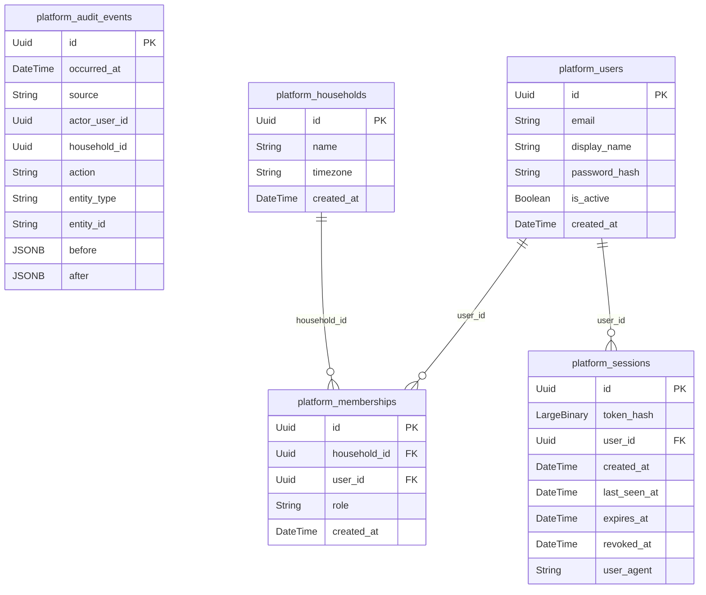

<!-- Generated by apps/api/src/family_hub/tools/generate.py. Do not edit; run `make generate`. -->

# Database

Tables and foreign keys, from the SQLAlchemy models. Entity names are `<schema>_<table>`. Audit events reference IDs without foreign keys (AUDIT-4).

